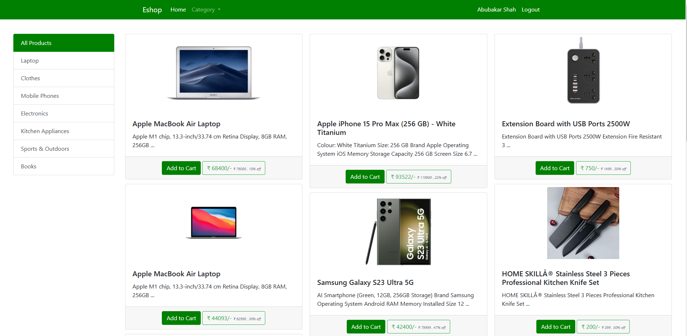
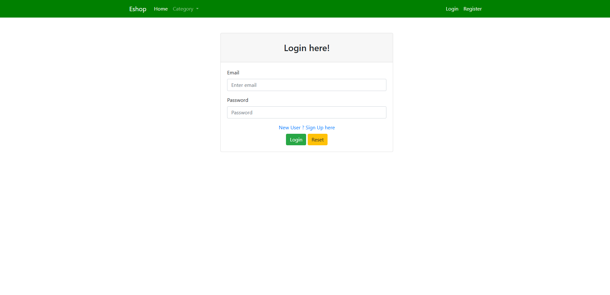
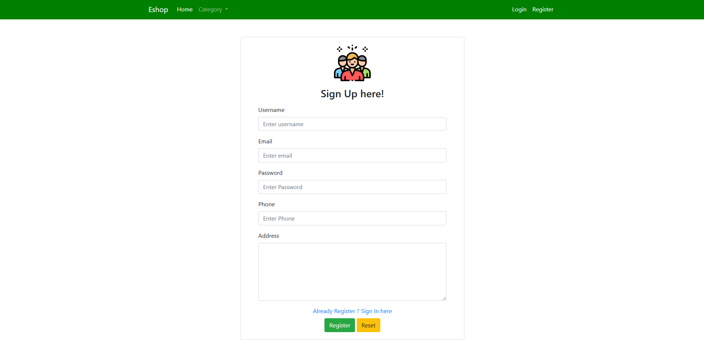
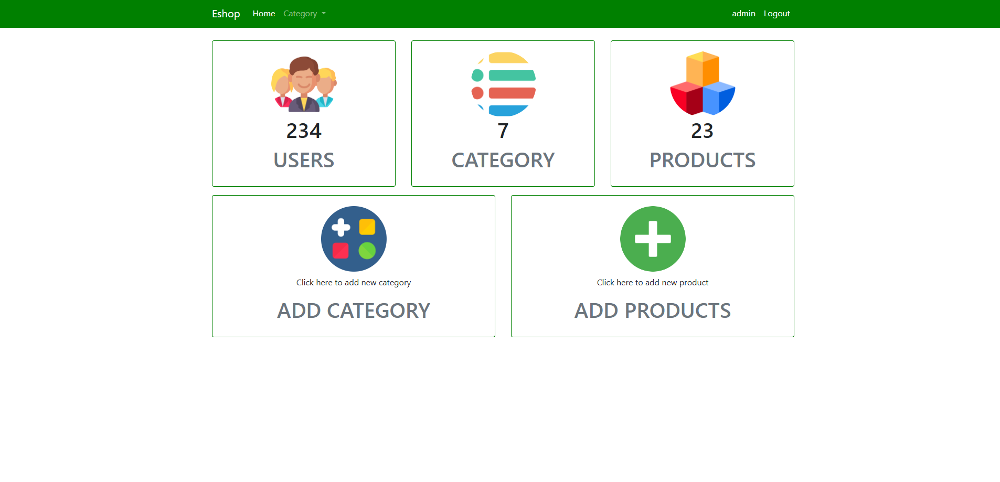
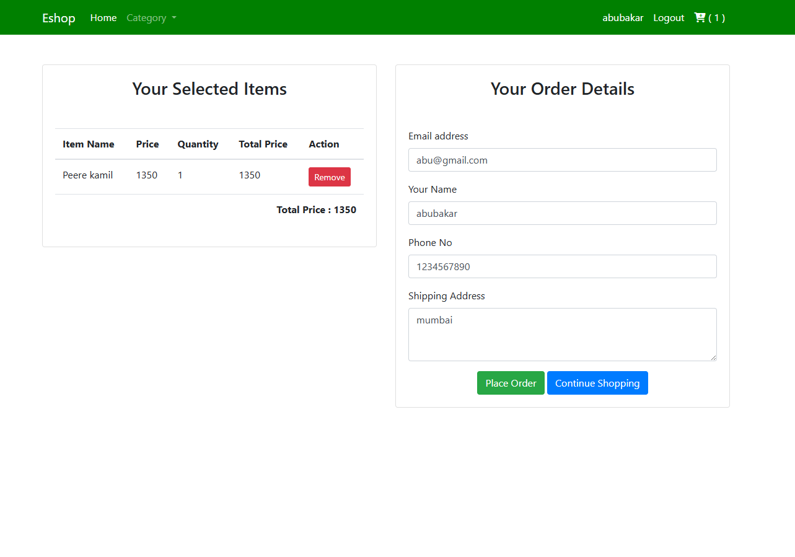
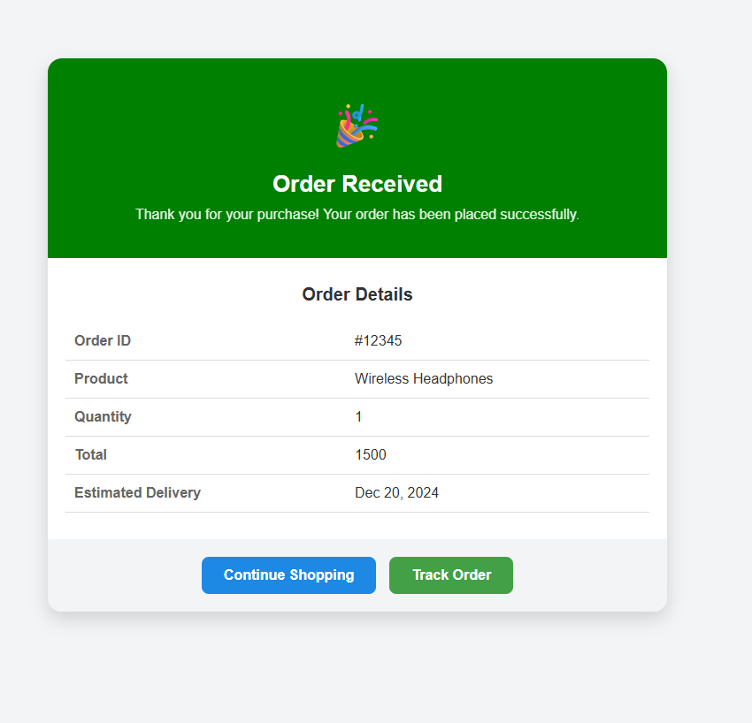

# 🛒 eShop – Java E-Commerce Application

**eShop** is a Java-based eCommerce project built using **Hibernate**, **MySQL**, and **JSP/Servlets**. It supports basic eCommerce functionalities such as user registration, product listing, cart management, and order placement.

---

## 💡 Features

- User Registration & Login
- Product Catalog with Categories
- Add to Cart / Remove from Cart
- Checkout and Order Summary
- Admin Panel for Product Management
- Hibernate ORM Integration
- MySQL Database Connectivity
- MVC Pattern using Servlets and JSP

---

## 🧰 Technologies Used

| Technology      | Purpose                     |
|-----------------|-----------------------------|
| Java (JDK 11+)  | Backend development          |
| Hibernate ORM   | Database interaction (DAO)   |
| MySQL           | Relational Database          |
| JSP / Servlets  | Web layer / UI               |
| HTML, CSS       | Frontend                     |
| Apache Tomcat   | Server Deployment            |
| Maven           | Dependency Management        |

---

## ⚙️ Project Setup

### 1. Clone the Repository

```bash
git clone https://github.com/your-username/eshop-ecommerce-java.git
cd eshop-ecommerce-java
````

### 2. Import in IDE

* Open NetBeans / IntelliJ / Eclipse
* Import the project as a Maven project

### 3. Setup MySQL Database

* Create a database:

```sql
CREATE DATABASE eshopdb;
```

* Import the provided SQL schema (if any)

### 4. Configure `hibernate.cfg.xml`

Update the file with your DB credentials:

```xml
<property name="hibernate.connection.url">jdbc:mysql://localhost:3306/eshopdb</property>
<property name="hibernate.connection.username">your_username</property>
<property name="hibernate.connection.password">your_password</property>
```

---

## 🚀 Running the Project

* Use Apache Tomcat (8 or higher) to deploy the app
* Start the server
* Access the app at:
  `http://localhost:8080/eshop`

---

## 📸 Screenshots

### 🏠 Home Page


### 📦 Login Page


### 🛒 SignUp Page


### ⚙️ Admin Dashboard


### ⚙️ cart page


### ⚙️ Order placed page


---

## ✍️ Author

**Abubakar Ahmad**


---


